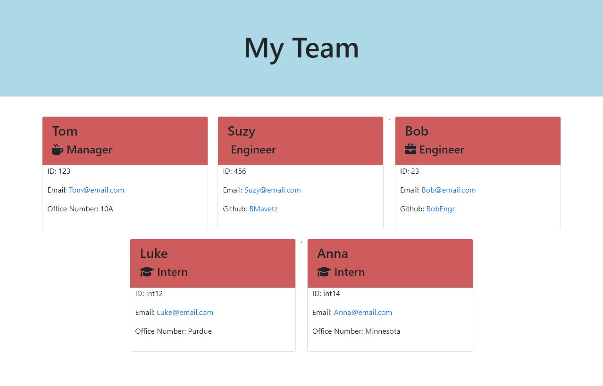

# Team Profile Generator

# Description

This application takes user inputs throught he node.js and allows a user to enter employee team members, such as manager, engineer(s), and intern(s), requesting specific information for each role.  The application then generates an HTML file that will display a webpage showing the employee members.

A unit test was written for every part of the code to ensure that it passes each test.

# Requirements

GIVEN a command-line application that accepts user input
WHEN I am prompted for my team members and their information
THEN an HTML file is generated that displays a nicely formatted team roster based on user input
WHEN I click on an email address in the HTML
THEN my default email program opens and populates the TO field of the email with the address
WHEN I click on the GitHub username
THEN that GitHub profile opens in a new tab
WHEN I start the application
THEN I am prompted to enter the team manager’s name, employee ID, email address, and office number
WHEN I enter the team manager’s name, employee ID, email address, and office number
THEN I am presented with a menu with the option to add an engineer or an intern or to finish building my team
WHEN I select the engineer option
THEN I am prompted to enter the engineer’s name, ID, email, and GitHub username, and I am taken back to the menu
WHEN I select the intern option
THEN I am prompted to enter the intern’s name, ID, email, and school, and I am taken back to the menu
WHEN I decide to finish building my team
THEN I exit the application, and the HTML is generated

# Tests

The testing suite can be run by opening the integrated terminal for the tests, and running an 'npm run test' command. The tests have built in values for each employee type sent to the employee contructors, so the user will not have to input any information.  If the tests pass, the employee constructors are properly filling in data for the different employee types.

# Webpage
The following shows the HTML webpage that is generated once the application is run.

# Video of application
A video of the application can be seen here: [Video](https://drive.google.com/file/d/1jFUF5a5zI_XXSQaXz0_asHR4Ci2QqDXc/view)